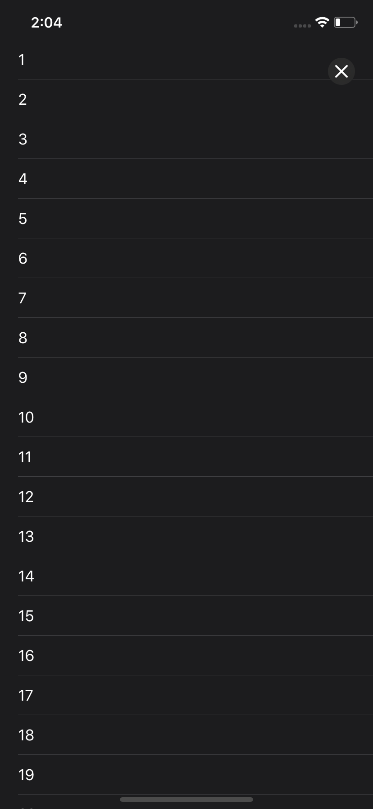
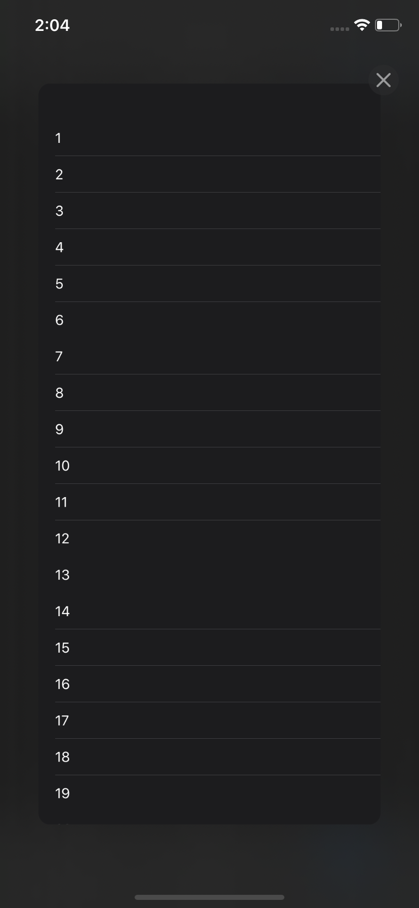
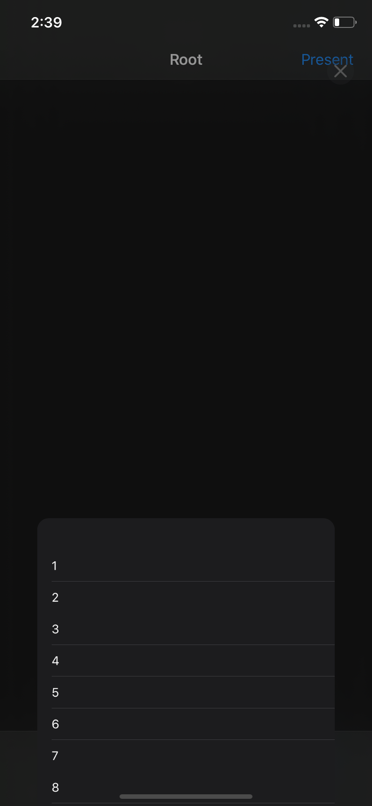

<body>
<p align="center">
	
</p>
</body>

# sheets

You always wanted to have that card-like controller similar to that in Maps or Shortcuts, didn't you? Well, now you can have it for free with sheets! sheets provides an easy to use container controller, that has API similar to that of UINavigationController. 

## Installation

### Swift Package Manager

**Requires XCode 11**. In project menu under Swift Packages add sheets via URL. 

### Cocoapods

In your Podfile add

```ruby
pod sheets
```

## Usage

The idea behind sheets is simple. sheets provides `SheetController` container view controller. It contains one _main view controller_ and one or more _view controllers_, presented inside the sheet. Main view controller is what is behind the sheet. This controller cannot be changed after initialization (at least for now). View controllers inside the sheet are dynamic, meaning they can be pushed and popped as needed, though there always has to be at least one VC in the stack (having no view controllers inside the card doesn't really make that much sense).

To start using sheets in your project, initialize `SheetController` via `init(mainViewController:rootViewController:anchors:)` initializer, then present it as you would any other view controller.

## Scrolling behavior

To enable the user to drag the sheet by its content, `SheetController` has to become a delegate of `UIScrollView`. Unfortunately, it is straight up impossible to set the `delegate` property of some scroll views (e.g. `UITableView` has to be its own delegate). Furthermore, various users of scroll views' API may want to intercept scrolling callbacks themselves. 

To alleviate this problem `sheets` introduces `Scrollable` and `ScrollableDelegate` protocols. If you want your custom views to be properly scrollable when presented as a part of `SheetController` you'll have to route scrolling events to the `delegate` object.

Steps:
1. Conform your view/view controller to `Scrollable` protocol.
2. Call `scrollableWillBeginDragging(_)`, `scrollableDidScroll(_)` and `scrollableWillEndDragging(_:withVelocity:targetContentOffset:)` methods inside `scrollViewWillBeginDragging(_:)`, `scrollViewDidScroll(_:)` and `scrollViewWillEndDragging(_:withVelocity:targetContentOffset:)` respectively. 

For those who do not need to override `UIScrollView` methods listed above `sheets` provides two convenience view controllers: `ScrollableTableViewController` and `ScrollableCollectionViewController`. Those VCs are `Scrollable` from the get-go!

## Customization

### Options

SheetController can be customized via a number of convenient options. Those options include:

| Option | Description | Default value |
| --- | --- | --- |
| `isExpandGestureEnabled` | Controls whether or not taps on the card's header make it expand. | `true` |
| `isCollapseGestureEnabled` | Controls whether or not taps on main view controller make the card collapse while it is fully expanded. | `true` |
| `cancelsTouchesInCollapsedState` | Controls whether or not taps on the card are blocked while it is collapsed. **When enabled messes up content dragging, will be resolved in future updates.** | `false` |
| `hidesTabBarUponExpansion` | Controls whether or not `SheetController` tries to hide tab bar (if present) upon the card's expansion. | `true` |
| `bounces` | Controls spring damping of card's animation. If set to `false`, sets damping to 1.0, which disables bounce. | `true` |
| `animatesCorners` | Controls whether or not card's corner radius is set to 0.0 when it is collapsed. This behavior is similar to that of Music's card UI. | `false` |
| `closeButtonImage` | Set this property to your custom close button image. | `nil` |
| `hasChevron` | Controls whether or not a chevron indicator is present at the top of each sheet. | `false` |

### Anchors

Another point of customization is anchors. Anchors define heights, to which sheet automatically snaps when the user stops dragging. Anchors themselves are defined in `Anchor` enum. Its cases are:

| Case | Description |
| --- | --- |
| `ratio(CGFloat)` | Associated value is a ratio between 0.0 and 1.0, where 0.0 means the very top and 1.0 the very bottom of the screen. |
| `pointsFromTop(CGFloat)` | Associated value defines how far from the top anchor point is going to be. |
| `pointsFromBottom(CGFloat)` | Associated value defines how far from the bottom anchor point is going to be. |
| `defaultExpanded` | Puts anchor point near the top of the screen. |
| `defaultCollapsed` | Puts anchor point near the bottom of the screen. |

Anchors can be set during initialization or via `setAnchors(_:animated:snapTo:)` method.

**Notes**: 
* Heights derived from `anchors` are computed relative to the view's safe area, so you don't have to worry about navigation bars, tab bars and toolbars.
* You don't have to order anchors in any particular way.
* The default anchors for each `SheetController` are `defaultExpanded` and `defaultCollapsed`.
* The exact constants for `defaultExpanded` and `defaultCollapsed` anchors are 20 points from top and 44 points from bottom respectively. The former constant replicates the expanded state of sheet-like UI in Apple's Shortcuts app. The latter constant is nice for a number of reasons: it's just enough to let the user drag on it, and when a navigation controller is presented inside thу sheet, navigation bar just barely touches the bottom in collapsed state. 

## App Store Presentation Style

sheets now also provides a presentation style that tries to emulate news presentation popping from below, just like Apple Arcade's categories. See [AppStoreTransitioningDelegate.swift](https://github.com/apstygo/sheets/blob/master/Sources/sheets/Presentations/Transitioning%20Delegates/AppStoreTransitioningDelegate.swift) for implementation details or [ExampleThreeCoordinator.swift](https://github.com/apstygo/sheets/blob/master/Example/sheets-example/Examples/ExampleThreeCoordinator.swift) for usage examples.

### Features

`AppStoreTransitioningDelegate` presents view controllers by popping them from below while blurring the background. It also adds a close button that does not interfere with your view controller's view hirerachy or layout.

`AppStoreTransitioningDelegate` makes use of `Scrollable` protocol to allow for interactive dismissal through dragging down. Dismissal through left screen edge pan works for all view controllers regardless of `Scrollable` conformance.

### Example usage

```swift
class CustomPresentingViewController: UIViewController {
	
	private let transitioningDelegate = AppStoreTransitioningDelegate()
	
	func present(this viewController: UIViewController) {
		viewController.modalPresentationStyle = .custom
		viewController.transitioningDelegate = transitioningDelegate
		present(viewController, animated: true)
	}
	
}
```

**Note:** Don't forget to retain the transitioning delegate or else this **won't work**.

### How it looks in action

<p align="center">
	
	
	
</p>

During the interactive portion of dismissal the view controller just shrinks around its center. When a certain threshold is passed, the view controller is sent downwards and completely dismissed.

Notice how during dismissal animation close button dims and its view's corner radius increases, while backround gradually loses its blur.

## Examples

You can find sample use cases in this [example app](https://github.com/apstygo/sheets/tree/master/Example).

## References

This library was inspired by these articles from the Yandex.Maps iOS team: 
1. [Custom paging in iOS](https://medium.com/yandex-maps-ios/custom-paging-в-ios-c4dd4611e589)
2. [Drawable card UI](https://medium.com/yandex-maps-ios/вытягивающаяся-карточка-bc2dac091e72)

## Licensing

This library is distributed under the MIT license.
